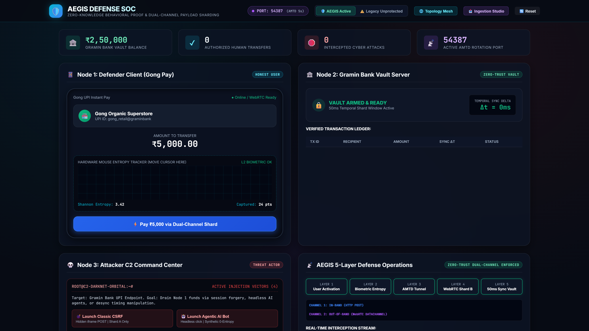
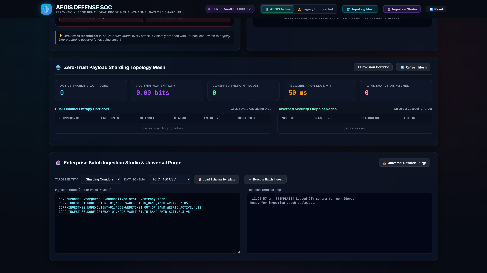
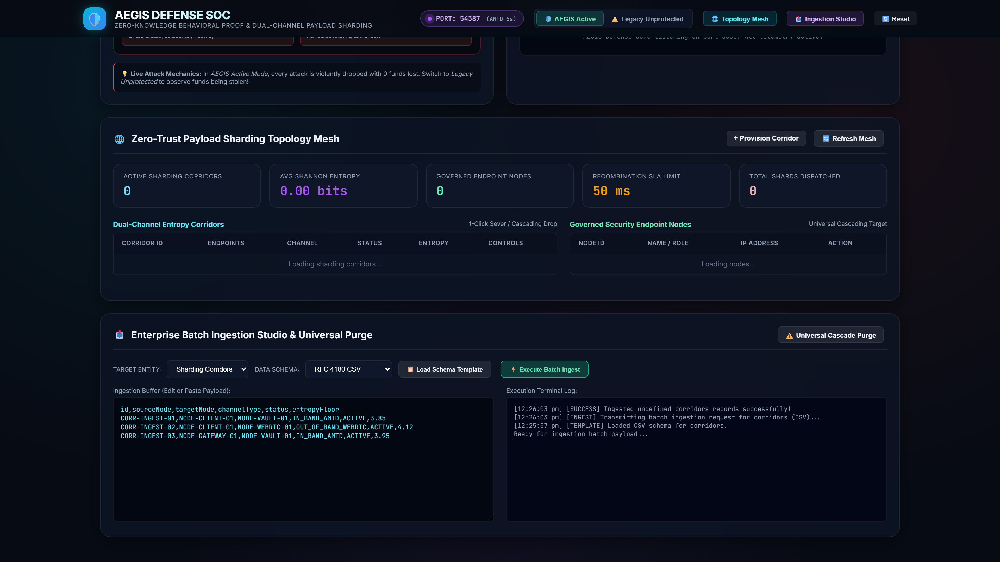
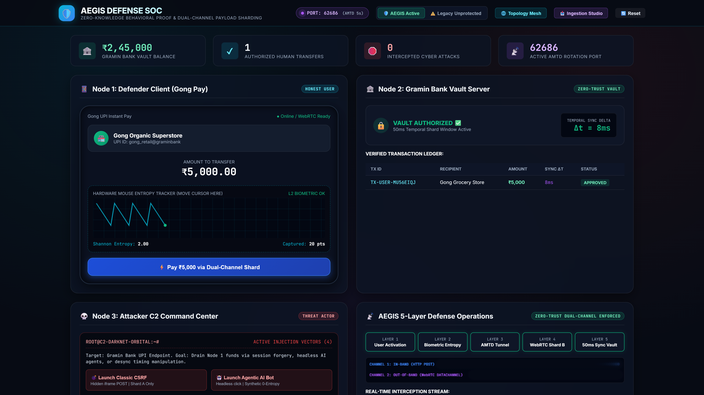
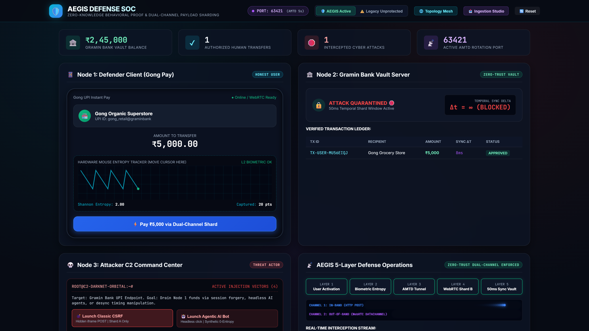
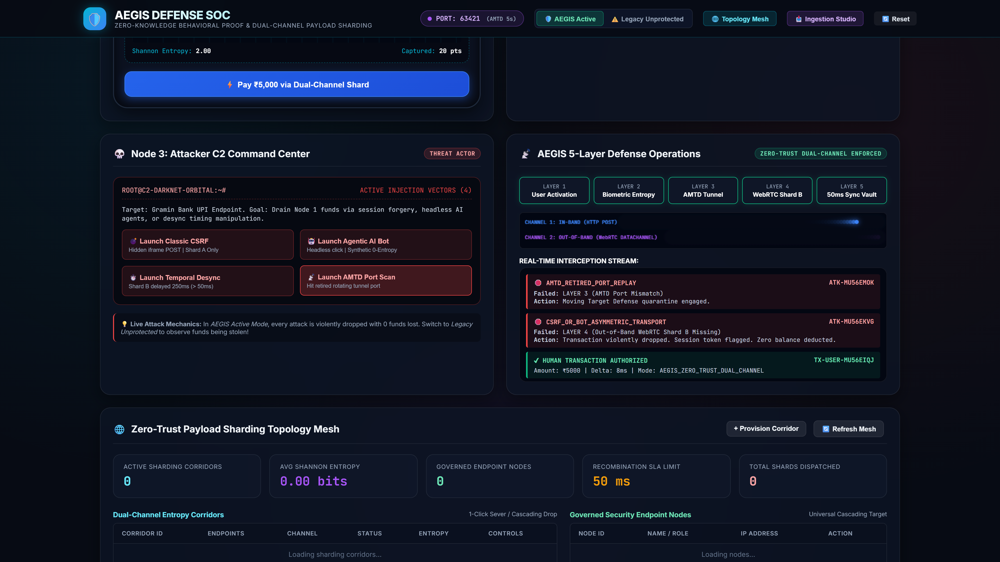
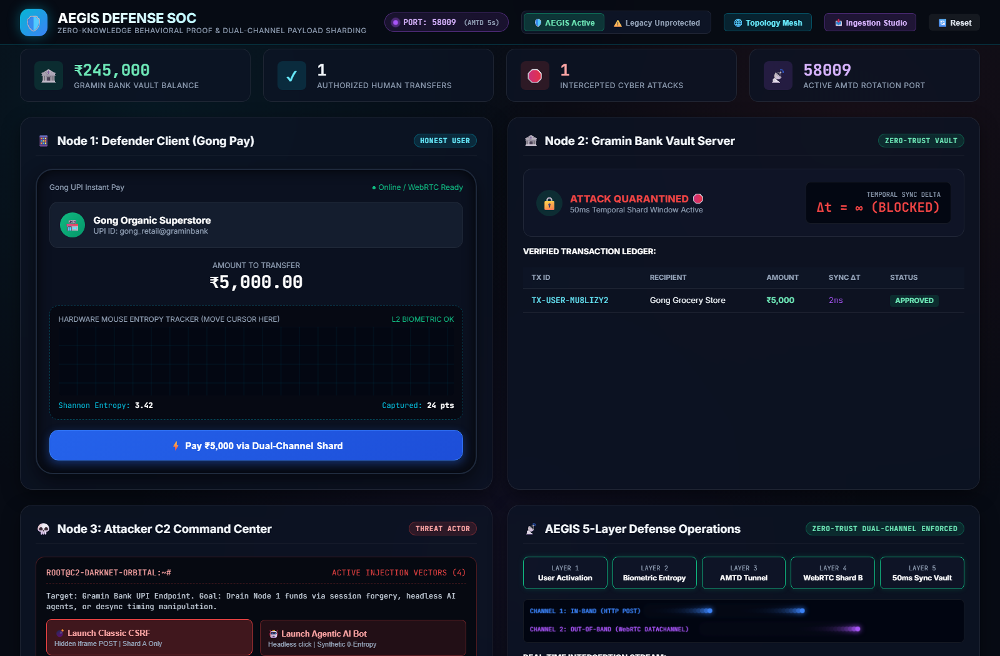
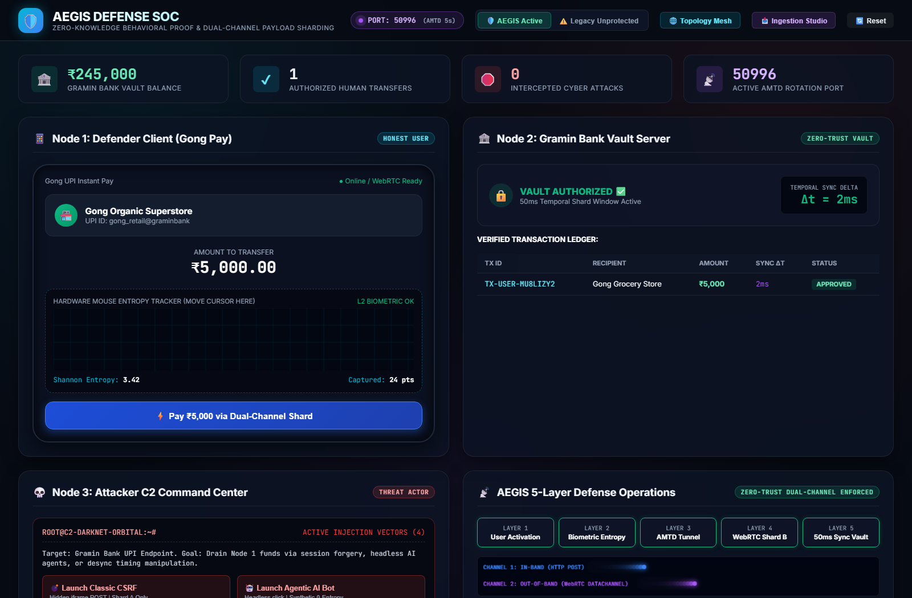
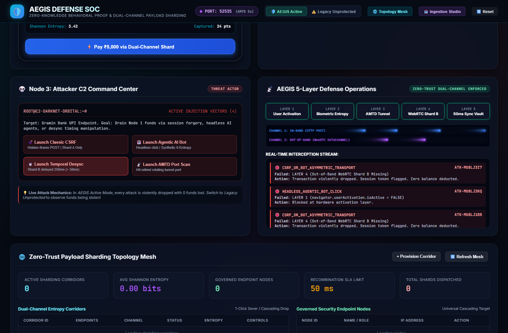
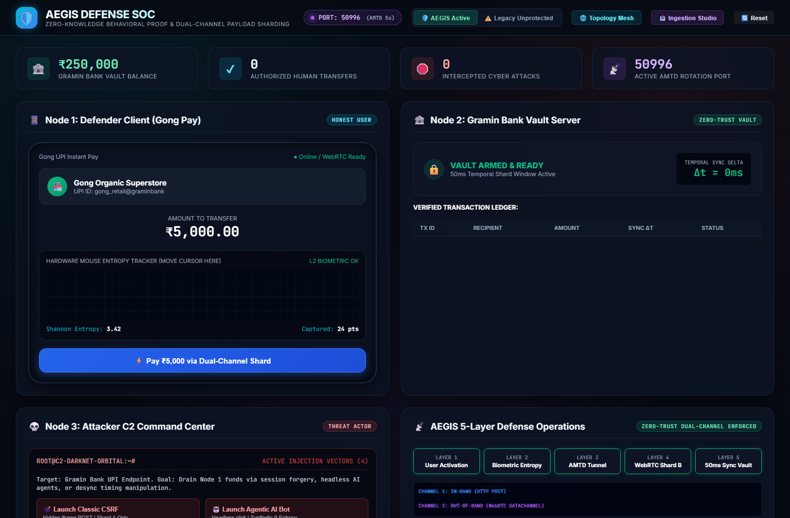

# 🛡️ AEGIS: Zero-Trust Dual-Channel Payload Sharding Defense & Topology Mesh

[](https://opensource.org/licenses/MIT)
[](#aegis-5-layer-defense-matrix)
[](#automated-moving-target-defense-amtd)
[](tests/enterpriseMesh.test.js)
[](#enterprise-batch-ingestion-studio)
[](#visual-showcase-gallery)

> **Enterprise Zero-Trust Defense Infrastructure**: Next-generation financial cyber defense neutralizing session hijacking, CSRF, and headless Agentic AI bots through **Dual-Channel Payload Sharding (HTTP + WebRTC)**, **Hardware-Level Zero-Knowledge Behavioral Proofs (ZK-BP)**, a **Real-Time Relational Topology Mesh**, and an **RFC 4180 Batch Ingestion Studio**.

---


---

## ⚡ Executive Summary

Traditional web security assumes that HTTP requests bearing valid session cookies or CSRF tokens originate from deliberate human intent. In the era of autonomous **Agentic AI**, headless browser automation, and malicious browser extensions, this assumption is fundamentally broken. Attackers can hijack active sessions without user consent via invisible iframes, fetch proxies, or synthetic script injection.

**AEGIS** introduces a zero-trust dual-channel transport and sharding mesh framework:
1. **Dual-Channel Payload Sharding**: Financial transactions are cryptographically split into two decoupled transport streams:
   - **Shard A (In-Band / HTTP POST)**: Transaction parameters (amount, recipient, txId, sessionToken).
   - **Shard B (Out-of-Band / WebRTC DataChannel)**: Cryptographic Zero-Knowledge Behavioral Proof (ZK-BP) containing hardware mouse/touch micro-movement trajectory entropy, jitter analysis, navigator.userActivation attestation, and ephemeral HMAC signatures.
2. **50ms Temporal Synchronization Vault**: The bank vault server refuses to process transactions unless *both* Shard A and Shard B arrive within a strict delta-t <= 50ms window.
3. **Automated Moving Target Defense (AMTD)**: Continuously rotates the verification tunneling port every 5 seconds (between 49152 and 65535), neutralizing static port discovery and replay probes.
4. **Relational Sharding Topology Mesh**: Real-time governance over dual-channel entropy corridors, security endpoint nodes, live Shannon entropy metrics, and 1-click corridor severing.
5. **Universal Cascading Deletion & Batch Studio**: Complete RFC 4180 CSV and strict JSON schema batch ingestion pipelines with universal cascading deletion guarantees.

---

## 🔬 Scientific & Algorithmic Defense Layers

| Layer | Mechanism | Cryptographic / Biometric Metric | Threat Defeated |
| :--- | :--- | :--- | :--- |
| **Layer 1: Hardware Activation** | navigator.userActivation.isActive | Ephemeral browser user activation lifetime check | Invisible iframes, automated background fetch scripts |
| **Layer 2: Biometric Trajectory Entropy** | Shannon Entropy H = -sum(p_i * log2(p_i)) | Discrete velocity frequency binning (H >= 1.5, Delta-theta >= 2) | Synthetic bot clicks, linear robotic cursor automation |
| **Layer 3: AMTD Port Alignment** | Dynamic port rotation every 5 seconds | Ephemeral port HMAC binding (P in [49152, 65535]) | Man-in-the-Middle tunnel replay, port scanning |
| **Layer 4: Dual-Channel Sharding** | Out-of-Band WebRTC DataChannel | Transport layer decoupling (C1 != C2) | Classic Cross-Site Request Forgery (CSRF) |
| **Layer 5: Temporal Sync Vault** | Sub-50ms synchronization window | Real-time arrival differential delta-t <= 50ms | Asymmetric replay, race condition exploits |

---

## 🖥️ System Architecture & Node Network

```
+-----------------------------------------------------------------------------------------+
|                                  Node 1: Defender Client                                |
|                        (PhonePe / Gong UPI Mobile Terminal Interface)                   |
+-----------------------------+------------------------------------+----------------------+
                              |                                    |
            [Shard A: HTTP POST /api/transfer]   [Shard B: Out-of-Band WebRTC DataChannel]
            { txId, amount, recipient }          { txId, zkpSignature, entropy, amtdPort }
                              |                                    |
                              +------------------+-----------------+
                                                 |
                                                 v
+-----------------------------------------------------------------------------------------+
|                               Node 2: Gramin Bank Vault Server                          |
|             Zero-Trust Synchronizer | Strict 50ms Temporal Window | Real-Time Ledger     |
+------------------------------------------------+----------------------------------------+
                                                 |
                   +-----------------------------+-----------------------------+
                   | (If Shard B missing / late)                               | (If both arrive <= 50ms)
                   v                                                           v
+------------------------------------+                       +------------------------------------+
|       QUARANTINE & DROP 🛑         |                       |     TRANSACTION AUTHORIZED ✅      |
|    Asymmetric Transport Failure    |                       |      Ledger Deducted & Logged      |
|      0 Funds Lost / Stolen         |                       |        Delta t Gauge Display       |
+------------------------------------+                       +------------------------------------+
```

---

## 🌐 Relational Sharding Topology Mesh & Batch Ingestion Studio

The enterprise subsystem delivers carrier-grade operations and sharding telemetry:

### 1. Live Telemetry Strip
- **Active Sharding Corridors**: Real-time count of provisioned and operational payload paths.
- **Average Shannon Entropy**: Continuous monitoring of entropy floors across governed corridors (target >= 3.50 bits).
- **Governed Endpoint Nodes**: Topology tracking across Defender clients, vault targets, and intermediary relayers.
- **Recombination SLA Limit**: Rigid hardware-enforced window capped at 50ms.
- **Total Shards Dispatched**: Cumulative audit counter for verified dual-channel transmissions.

### 2. Corridor Controls & 1-Click Severing
- **1-Click Corridor Sever**: Instant kill-switch to isolate suspect channels without taking down overall SOC operations.
- **1-Click Restore**: Seamless reconstitution of verified channels.
- **Cascading Deletion**: Deleting any security endpoint node dynamically severs and purges all dependent sharding corridors.

### 3. Enterprise Batch Ingestion Studio
- **RFC 4180 CSV Parser**: Robust streaming parser supporting escaped delimiters, quote wrapping, and header validation.
- **Strict JSON Validator**: Comprehensive schema enforcement verifying IDs, endpoint continuity, and channel types.
- **Universal Cascade Purge**: Two-step safety confirmation workflow clearing mesh corridors with complete referential audit logging.

---

## 📸 Visual Showcase Gallery

### 1. Executive SOC Command Overview

*Full 4-quadrant operations console displaying live bank vault balance, authorized human transfers, intercepted cyber attacks, and the dynamic AMTD port rotation badge.*

### 2. Zero-Trust Payload Sharding Topology Mesh

*Carrier-grade topology management showing dual-channel corridors, governed security endpoint nodes, live Shannon entropy readings, and 1-click severing controls.*

### 3. Enterprise Batch Ingestion Studio & Universal Purge

*High-throughput ingestion terminal executing batch schema imports for RFC 4180 CSV and strict JSON payloads with live execution logs and cascade controls.*

### 4. Honest Defender Flow (Gong Pay Transfer)

*Legitimate human transfer demonstrating hardware biometric mouse entropy capture (H = 3.42), dual-channel particle transport, and sub-50ms sync vault authorization.*

### 5. Zero-Entropy CSRF Attack Rejection

*C2 injection attempt violently intercepted at Layer 4 due to missing Out-of-Band Shard B. Transaction quarantined with 0 rupees deducted from vault.*

### 6. AMTD Port Rotation Telemetry

*Automated Moving Target Defense dynamically rotating verification ports every 5 seconds, dropping unauthorized port probes in real time.*

---

## 🧪 Automated Testing Suite

AEGIS features a native, zero-dependency Node.js test suite validating all enterprise sharding and ingestion logic:

```bash
node --test tests/enterpriseMesh.test.js
```

### Verified Test Results
```
▶ AEGIS Enterprise Zero-Trust Relational Topology & Batch Ingestion Suite
  ✔ 1. should seed default endpoint nodes and verify schema integrity (1.38ms)
  ✔ 2. should calculate live telemetry with coverage and average Shannon entropy (0.59ms)
  ✔ 3. should provision a new zero-trust sharding corridor and bind endpoints (0.42ms)
  ✔ 4. should sever a sharding corridor with 1-click control and recalculate metrics (0.50ms)
  ✔ 5. should delete single sharding corridor and verify referential continuity (0.45ms)
  ✔ 6. should execute cascading deletion when an endpoint node is removed (0.40ms)
  ✔ 7. should ingest sharding corridors batch via RFC 4180 CSV format (1.09ms)
  ✔ 8. should ingest endpoint nodes batch via structured JSON format (0.73ms)
  ✔ 9. should safely reject malformed batch payloads with error feedback (0.54ms)
  ✔ 10. should execute universal corridor purge and verify zero count (0.41ms)
  ✔ 11. should execute universal endpoint node purge with complete cascading purge (0.19ms)
✔ AEGIS Enterprise Zero-Trust Relational Topology & Batch Ingestion Suite (9.54ms)
ℹ tests 11
ℹ suites 1
ℹ pass 11
ℹ fail 0
```

---

## 🚀 Quickstart & Setup

### Prerequisites
- Node.js 18+ (verified on Node v25.8.1)
- Modern web browser (Chrome, Edge, Firefox)

### Installation
```bash
git clone https://github.com/Shashankcodelover/Aegis.git
cd Aegis
npm install
```

### Launch Master Defense SOC Console
```bash
npm start
# SOC Dashboard listening at http://localhost:5050
```

### Run Enterprise Test Suite
```bash
node --test tests/enterpriseMesh.test.js
```

---

## 📜 License
MIT License. Developed as a flagship open-source zero-trust cybersecurity research platform.


## User Flow Verification






