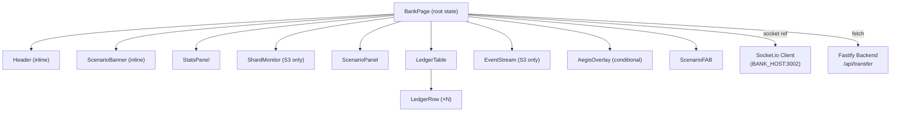
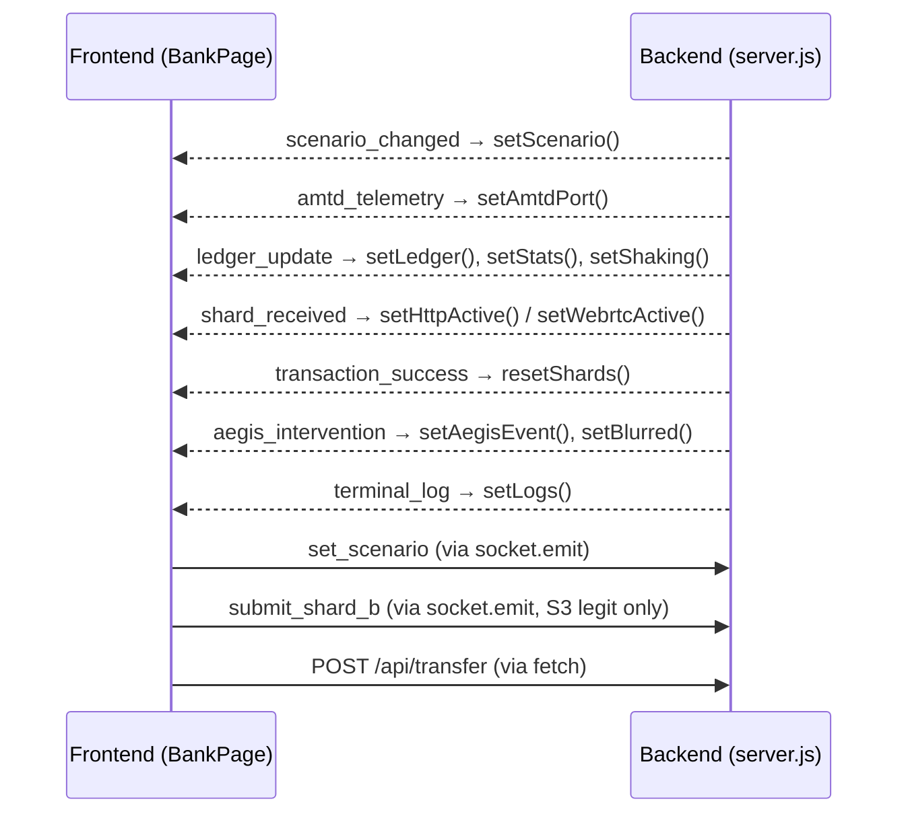
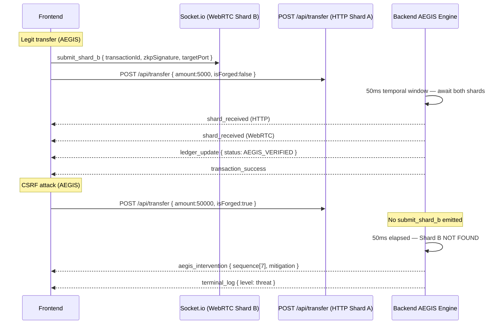

# Design Document — rural-bank-3-scenario

## Overview

This feature is a complete rewrite of the Person 2 bank frontend (`app/page.tsx`) to deliver a structured, presentation-ready three-scenario CSRF security demonstration. The existing Fastify + Socket.io backend (`server.js`, port 3002) already implements all scenario logic and event emission; the frontend is the sole deliverable.

The demo contrasts two visual identities:

- **Rural Mode** (Scenarios 1 & 2) — warm cream/green palette, Inter font, "innocent rural bank" narrative.
- **AEGIS Mode** (Scenario 3) — near-black background, Cyber Teal palette, JetBrains Mono, zero-trust security narrative.

The frontend connects to the backend via Socket.io WebSocket and HTTP fetch. All state is managed with React hooks inside a single `BankPage` root component. Sub-components are pure presentational components that receive props.

---

## Architecture

### High-Level Component Diagram



### Data Flow Diagram — Socket.io Events



### Scenario 3 Dual-Channel Transaction Flow



---

## Components and Interfaces

### BankPage (default export)

Root component. Owns all state. Initialises Socket.io connection on mount, tears it down on unmount. Renders the full page layout.

```typescript
// No props — root component
export default function BankPage(): JSX.Element
```

Responsibilities:
- Socket.io lifecycle (connect, event listeners, disconnect)
- All state mutations
- Passing handlers and state slices down to child components
- Applying screen-shake animation to root `motion.div`
- Applying blur filter to main content when `blurred === true`

### ScenarioPanel

Renders the correct simulation buttons for the active scenario. Receives handlers as props.

```typescript
interface ScenarioPanelProps {
  scenario: Scenario;
  onLegitTransfer: () => void;
  onCsrfNoAegis: () => void;
  onLegitTransferAegis: () => void;
  onCsrfAegisActive: () => void;
}
```

Button rendering rules:
- `SCENARIO_1`: 1 button — "SIMULATE LEGITIMATE TRANSFER" → `onLegitTransfer`
- `SCENARIO_2`: 2 buttons — "SIMULATE LEGITIMATE TRANSFER" → `onLegitTransfer`, "LAUNCH CSRF ATTACK (NO AEGIS)" → `onCsrfNoAegis`
- `SCENARIO_3`: 2 buttons — "SIMULATE LEGITIMATE TRANSFER (AEGIS)" → `onLegitTransferAegis`, "LAUNCH CSRF ATTACK (AEGIS ACTIVE)" → `onCsrfAegisActive`

Each button must carry a descriptive `aria-label` including action and scenario context.

### LedgerTable

Renders the live transaction table. Wraps rows in `AnimatePresence`.

```typescript
interface LedgerTableProps {
  entries: LedgerEntry[];
  isAegisMode: boolean;
}
```

Must expose `aria-live="polite"` and `aria-label="Live transaction ledger"` on its container.

### LedgerRow

Single animated table row. Pure presentational.

```typescript
interface LedgerRowProps {
  entry: LedgerEntry;
}
```

Animation: `initial={{ opacity: 0, x: -16 }}` → `animate={{ opacity: 1, x: 0 }}`, duration 350ms.

Status badge mapping:

| Status | Badge text | Badge bg | Badge text color | Row bg |
|---|---|---|---|---|
| `LEGITIMATE_SUCCESS` | ✓ Approved | `#dcfce7` | `#166534` | white |
| `CRITICAL_THEFT_SUCCESS` | ⚠ THEFT PROCESSED | `#fee2e2` | `#dc2626` | `#fef2f2` |
| `AEGIS_VERIFIED` | ⚡ AEGIS VERIFIED Δ{delta}ms | `#ccfbf1` | `#0e7490` | `#f0fdfa` |
| `AEGIS_BLOCKED` | ✗ AEGIS BLOCKED | `#ffedd5` | `#c2410c` | `#fff7ed` |

### AegisOverlay

Full-screen modal. Manages its own typewriter animation state internally.

```typescript
interface AegisOverlayProps {
  data: AegisEvent;
  onClose: () => void;
}
```

Internal state: `lines: string[]`, `done: boolean`.

On mount: starts an interval that appends one line from `data.sequence` every 400ms. Clears interval when all lines printed, sets `done = true`.

Must be implemented as `role="dialog"` with `aria-modal="true"` and `aria-label="AEGIS Intervention Alert"`. Must expose `aria-live="assertive"` on the terminal sequence container. Must receive focus on open; must return focus to the triggering button on close.

Animation: `initial={{ scale: 0.8, y: 50 }}` → `animate={{ scale: 1, y: 0 }}`, spring stiffness 280, damping 24.

### ScenarioFAB

Floating action button. Manages its own `open: boolean` state.

```typescript
interface ScenarioFABProps {
  current: Scenario;
  onChange: (s: Scenario) => void;
}
```

Fixed position: `bottom: 24px`, `right: 24px`. FAB background color = `SCENARIO_INFO[current].color`.

Panel animation: `initial={{ opacity: 0, y: 12, scale: 0.95 }}` → `animate={{ opacity: 1, y: 0, scale: 1 }}`, 200ms.

Must have `aria-label="Switch Demo Scenario"` and `aria-expanded={open}`.

### ShardMonitor

Displays AEGIS shard status. Rendered only when `scenario === 'SCENARIO_3'`.

```typescript
interface ShardMonitorProps {
  httpActive: boolean;
  webrtcActive: boolean;
  amtdPort: number;
}
```

Three rows: HTTP Shard A (cyan glow when active), WebRTC Shard B (emerald glow when active), AMTD Port (live number).

Glow style when active: `boxShadow: '0 0 6px <color>'`.

### EventStream

AEGIS terminal log. Rendered only when `scenario === 'SCENARIO_3'`. Fixed height 160px.

```typescript
interface EventStreamProps {
  logs: TerminalLog[];
  logEndRef: React.RefObject<HTMLDivElement>;
}
```

Must expose `aria-live="polite"` and `aria-label="AEGIS event stream"`.

Color mapping: `threat` → `#ef4444` + "⚠ " prefix, `success` → `#2dd4bf` + "✓ " prefix, other → `#22c55e`.

### StatsPanel

Three counter cards.

```typescript
interface StatsPanelProps {
  stats: { ok: number; theft: number; blocked: number };
  isAegisMode: boolean;
}
```

---

## Data Models

```typescript
type Scenario = 'SCENARIO_1' | 'SCENARIO_2' | 'SCENARIO_3';

type LedgerStatus =
  | 'LEGITIMATE_SUCCESS'
  | 'CRITICAL_THEFT_SUCCESS'
  | 'AEGIS_VERIFIED'
  | 'AEGIS_BLOCKED';

interface LedgerEntry {
  id: string;
  sender: string;
  receiver: string;
  amount: number | string;
  status: LedgerStatus;
  scenario: Scenario;
  timestamp: string;   // ISO 8601
  delta?: number;      // ms, AEGIS_VERIFIED only
}

interface AegisEvent {
  id: string;
  reason: string;
  mitigation: string;
  sequence: string[];  // exactly 7 lines from backend
  timestamp: number;   // Unix ms
}

interface TerminalLog {
  id: string;          // client-generated uid
  level: string;       // 'threat' | 'success' | other
  message: string;
  ts: number;          // Unix ms
}

// Root BankPage state shape
interface BankPageState {
  scenario: Scenario;
  ledger: LedgerEntry[];          // max 50 entries, newest first
  aegisEvent: AegisEvent | null;
  connected: boolean;
  amtdPort: number;
  httpActive: boolean;
  webrtcActive: boolean;
  stats: { ok: number; theft: number; blocked: number };
  blurred: boolean;
  shaking: boolean;
  logs: TerminalLog[];            // max 200 entries
}
```

### Transaction ID Format

```
txn_{Date.now()}_{Math.random().toString(36).slice(2, 6)}
```

Example: `txn_1718000000000_a3f9`

### Socket.io Payload Contracts

**Outbound — `submit_shard_b`:**
```typescript
{ transactionId: string; zkpSignature: string; targetPort: number }
```

**Outbound — `set_scenario`:**
```typescript
{ scenario: 'SCENARIO_1' | 'SCENARIO_2' | 'SCENARIO_3' }
```

**Inbound — `ledger_update`:** maps to `LedgerEntry`

**Inbound — `aegis_intervention`:** maps to `AegisEvent`

**Inbound — `terminal_log`:**
```typescript
{ level: string; message: string; timestamp: number }
```

**Inbound — `amtd_telemetry`:**
```typescript
{ current_port: number; timestamp: number }
```

**Inbound — `shard_received`:**
```typescript
{ protocol: 'HTTP' | 'WebRTC'; transactionId: string; timestamp: number }
```

---

## Correctness Properties

*A property is a characteristic or behavior that should hold true across all valid executions of a system — essentially, a formal statement about what the system should do. Properties serve as the bridge between human-readable specifications and machine-verifiable correctness guarantees.*

### Property 1: Transaction ID uniqueness and format

*For any* number of simulation button clicks, every generated `transactionId` SHALL match the pattern `/^txn_\d+_[a-z0-9]{4}$/` and no two IDs generated in the same session SHALL be identical.

**Validates: Requirements 1.8**

---

### Property 2: FAB background color matches active scenario

*For any* active scenario value (`SCENARIO_1`, `SCENARIO_2`, or `SCENARIO_3`), the ScenarioFAB background color SHALL equal `SCENARIO_INFO[scenario].color` for that scenario.

**Validates: Requirements 4.6**

---

### Property 3: FAB panel marks only the active scenario with a checkmark

*For any* active scenario, when the ScenarioFAB panel is open, exactly one scenario option SHALL display a checkmark indicator, and it SHALL be the currently active scenario.

**Validates: Requirements 4.7**

---

### Property 4: Ledger entries are always prepended (newest first)

*For any* sequence of `ledger_update` Socket.io events, the ledger array SHALL always have the most recently received entry at index 0.

**Validates: Requirements 5.1**

---

### Property 5: LedgerRow badge correctness for any entry

*For any* `LedgerEntry` object, the rendered `LedgerRow` SHALL display the badge text, badge background color, and badge text color that correspond exactly to the entry's `status` field according to the status-badge mapping table.

**Validates: Requirements 5.3, 5.4, 5.5, 5.6**

---

### Property 6: Ledger maximum capacity

*For any* sequence of `ledger_update` events of length N > 50, the ledger array length SHALL never exceed 50, and the 50 retained entries SHALL be the 50 most recently received.

**Validates: Requirements 5.9**

---

### Property 7: Terminal log level color and prefix

*For any* `terminal_log` event, the rendered log entry SHALL use the color and prefix that correspond to its `level` field: `threat` → Alert Red (`#ef4444`) + "⚠ " prefix, `success` → Cyber Teal (`#2dd4bf`) + "✓ " prefix, all other levels → green (`#22c55e`) with no special prefix.

**Validates: Requirements 8.3, 8.4, 8.5**

---

### Property 8: Terminal log maximum capacity

*For any* sequence of `terminal_log` events of length N > 200, the logs array length SHALL never exceed 200, and the 200 retained entries SHALL be the 200 most recently received.

**Validates: Requirements 8.6**

---

### Property 9: Stats counters accurately reflect ledger event history

*For any* sequence of `ledger_update` events, the `stats.ok` counter SHALL equal the count of events with status `LEGITIMATE_SUCCESS` or `AEGIS_VERIFIED`, `stats.theft` SHALL equal the count with `CRITICAL_THEFT_SUCCESS`, and `stats.blocked` SHALL equal the count with `AEGIS_BLOCKED`.

**Validates: Requirements 9.2, 9.3, 9.4**

---

### Property 10: Simulation buttons always have descriptive aria-labels

*For any* active scenario, every rendered simulation button in the ScenarioPanel SHALL have a non-empty `aria-label` attribute that describes the action and scenario context.

**Validates: Requirements 11.1**

---

### Property 11: LedgerEntry deserialization preserves all required fields

*For any* valid `ledger_update` payload received from the backend, the deserialized `LedgerEntry` object SHALL contain all required fields (`id`, `sender`, `receiver`, `amount`, `status`, `scenario`, `timestamp`) with their correct types, and the optional `delta` field SHALL be present when included in the payload.

**Validates: Requirements 12.1**

---

### Property 12: Amount rendered as locale-formatted Indian Rupee string

*For any* numeric `amount` value in a `LedgerEntry`, the rendered amount string SHALL equal `"₹" + Number(amount).toLocaleString('en-IN')`.

**Validates: Requirements 12.5**

---

## Error Handling

### Network Failures

- `fetch` calls to `/api/transfer` are wrapped in `.catch(() => {})` — failures are silently swallowed to avoid crashing the demo. The backend will not emit a `ledger_update` for failed requests, so the ledger simply shows no new entry.
- Socket.io handles reconnection automatically via its built-in retry logic. The `connected` state reflects the current connection status and drives the UI indicator.

### Missing Shard B (AEGIS Scenario)

This is an intentional "error" path in Scenario 3. When the CSRF attack button is clicked, no `submit_shard_b` is emitted. The backend detects the missing shard after its 50ms temporal window and emits `aegis_intervention`. The frontend handles this by rendering the `AegisOverlay` and blurring the background.

### Stale AMTD Port

If `submit_shard_b` is emitted with a stale `targetPort` (the AMTD port rotated between emit and receipt), the backend emits a `terminal_log` with `level: "threat"` indicating the block. The frontend renders this in the EventStream terminal. No special error state is needed.

### State Bounds

- Ledger capped at 50 entries: `setLedger(p => [e, ...p].slice(0, 50))`
- Logs capped at 200 entries: `setLogs(p => [...p.slice(-199), newEntry])`

### Focus Management Errors

If the ref to the triggering button is lost before the overlay closes (e.g., the button was removed from the DOM), focus falls back to `document.body` rather than throwing.

---

## Testing Strategy

### PBT Library

**[fast-check](https://fast-check.dev/)** — TypeScript-native property-based testing library. Integrates with Vitest (the test runner already implied by the Next.js 16 + TypeScript stack).

Install: `npm install --save-dev fast-check vitest @testing-library/react @testing-library/user-event`

### Unit Tests (Example-Based)

Unit tests cover specific rendering assertions, interaction flows, and edge cases that are deterministic and not suited to property generation:

- ScenarioPanel renders correct button count and labels per scenario
- Button click handlers call correct fetch/socket payloads
- AegisOverlay typewriter sequence timing (fake timers)
- ShardMonitor indicator illumination on socket events
- EventStream auto-scroll behavior
- Socket.io connection lifecycle (connect, disconnect, cleanup)
- Accessibility attributes (aria-live, aria-label, role, aria-modal)
- Focus management (overlay open → focus moves; overlay close → focus returns)
- Visual mode transitions (Rural ↔ AEGIS background/typography)

### Property-Based Tests

Each property test runs a minimum of **100 iterations** via fast-check. Tag format in comments: `Feature: rural-bank-3-scenario, Property N: <property text>`.

**Property 1 — Transaction ID uniqueness and format**
```typescript
// Feature: rural-bank-3-scenario, Property 1: transactionId uniqueness and format
fc.assert(fc.property(fc.integer({ min: 1, max: 500 }), (n) => {
  const ids = Array.from({ length: n }, generateTransactionId);
  return ids.every(id => /^txn_\d+_[a-z0-9]{4}$/.test(id))
    && new Set(ids).size === ids.length;
}));
```

**Property 2 — FAB background color matches active scenario**
```typescript
// Feature: rural-bank-3-scenario, Property 2: FAB background color matches active scenario
fc.assert(fc.property(fc.constantFrom('SCENARIO_1','SCENARIO_2','SCENARIO_3'), (scenario) => {
  const { getByTitle } = render(<ScenarioFAB current={scenario} onChange={() => {}} />);
  const fab = getByTitle('Switch Demo Scenario');
  return fab.style.backgroundColor === hexToRgb(SCENARIO_INFO[scenario].color);
}));
```

**Property 3 — FAB panel marks only the active scenario**
```typescript
// Feature: rural-bank-3-scenario, Property 3: FAB panel marks only the active scenario with a checkmark
fc.assert(fc.property(fc.constantFrom('SCENARIO_1','SCENARIO_2','SCENARIO_3'), (scenario) => {
  // open FAB, assert exactly one checkmark, on the active scenario
}));
```

**Property 4 — Ledger entries always prepended**
```typescript
// Feature: rural-bank-3-scenario, Property 4: ledger entries are always prepended (newest first)
fc.assert(fc.property(fc.array(arbitraryLedgerEntry(), { minLength: 1, maxLength: 30 }), (entries) => {
  // simulate emitting entries in order, assert ledger[0] is always the last emitted
}));
```

**Property 5 — LedgerRow badge correctness**
```typescript
// Feature: rural-bank-3-scenario, Property 5: LedgerRow badge correctness for any entry
fc.assert(fc.property(arbitraryLedgerEntry(), (entry) => {
  const { container } = render(<LedgerRow entry={entry} />);
  // assert badge text and colors match status-badge mapping
}));
```

**Property 6 — Ledger maximum capacity**
```typescript
// Feature: rural-bank-3-scenario, Property 6: ledger maximum capacity
fc.assert(fc.property(fc.array(arbitraryLedgerEntry(), { minLength: 51, maxLength: 200 }), (entries) => {
  // simulate emitting all entries, assert ledger.length <= 50
}));
```

**Property 7 — Terminal log level color and prefix**
```typescript
// Feature: rural-bank-3-scenario, Property 7: terminal log level color and prefix
fc.assert(fc.property(arbitraryTerminalLog(), (log) => {
  const { container } = render(<EventStream logs={[log]} logEndRef={ref} />);
  // assert color and prefix match level
}));
```

**Property 8 — Terminal log maximum capacity**
```typescript
// Feature: rural-bank-3-scenario, Property 8: terminal log maximum capacity
fc.assert(fc.property(fc.array(arbitraryTerminalLog(), { minLength: 201, maxLength: 500 }), (logs) => {
  // simulate emitting all logs, assert logs.length <= 200
}));
```

**Property 9 — Stats counters accurately reflect ledger event history**
```typescript
// Feature: rural-bank-3-scenario, Property 9: stats counters accurately reflect ledger event history
fc.assert(fc.property(fc.array(arbitraryLedgerEntry(), { minLength: 1, maxLength: 100 }), (entries) => {
  // simulate emitting all entries, assert stats match counts
}));
```

**Property 10 — Simulation buttons always have descriptive aria-labels**
```typescript
// Feature: rural-bank-3-scenario, Property 10: simulation buttons always have descriptive aria-labels
fc.assert(fc.property(fc.constantFrom('SCENARIO_1','SCENARIO_2','SCENARIO_3'), (scenario) => {
  const { getAllByRole } = render(<ScenarioPanel scenario={scenario} ...handlers />);
  const buttons = getAllByRole('button');
  return buttons.every(b => b.getAttribute('aria-label')?.length > 0);
}));
```

**Property 11 — LedgerEntry deserialization preserves all required fields**
```typescript
// Feature: rural-bank-3-scenario, Property 11: LedgerEntry deserialization preserves all required fields
fc.assert(fc.property(arbitraryLedgerUpdatePayload(), (payload) => {
  const entry = deserializeLedgerEntry(payload);
  return ['id','sender','receiver','amount','status','scenario','timestamp']
    .every(field => field in entry);
}));
```

**Property 12 — Amount rendered as locale-formatted Indian Rupee string**
```typescript
// Feature: rural-bank-3-scenario, Property 12: amount rendered as locale-formatted Indian Rupee string
fc.assert(fc.property(fc.integer({ min: 1, max: 10_000_000 }), (amount) => {
  const entry = { ...baseEntry, amount };
  const { getByText } = render(<LedgerRow entry={entry} />);
  const expected = '₹' + Number(amount).toLocaleString('en-IN');
  return !!getByText(expected);
}));
```

### Arbitrary Generators

```typescript
const arbitraryLedgerEntry = () => fc.record({
  id: fc.string({ minLength: 1 }),
  sender: fc.string({ minLength: 1 }),
  receiver: fc.string({ minLength: 1 }),
  amount: fc.oneof(fc.integer({ min: 1 }), fc.double({ min: 1 })),
  status: fc.constantFrom('LEGITIMATE_SUCCESS','CRITICAL_THEFT_SUCCESS','AEGIS_VERIFIED','AEGIS_BLOCKED'),
  scenario: fc.constantFrom('SCENARIO_1','SCENARIO_2','SCENARIO_3'),
  timestamp: fc.date().map(d => d.toISOString()),
  delta: fc.option(fc.nat()),
});

const arbitraryTerminalLog = () => fc.record({
  id: fc.string({ minLength: 1 }),
  level: fc.oneof(fc.constant('threat'), fc.constant('success'), fc.string()),
  message: fc.string(),
  ts: fc.integer({ min: 0 }),
});
```

### Integration Tests

- End-to-end: mount `BankPage` with a mocked Socket.io server, simulate the full Scenario 3 CSRF attack flow, assert `AegisOverlay` appears with correct sequence lines.
- End-to-end: simulate the full Scenario 3 legitimate transfer flow, assert `AEGIS_VERIFIED` ledger entry appears.
