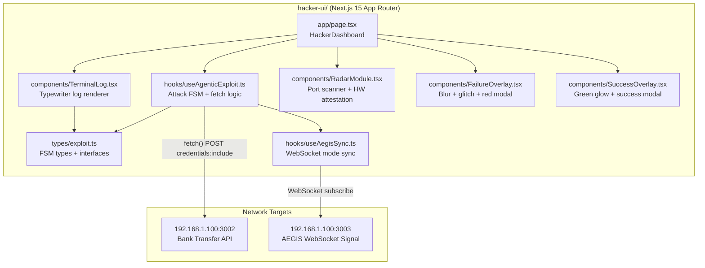
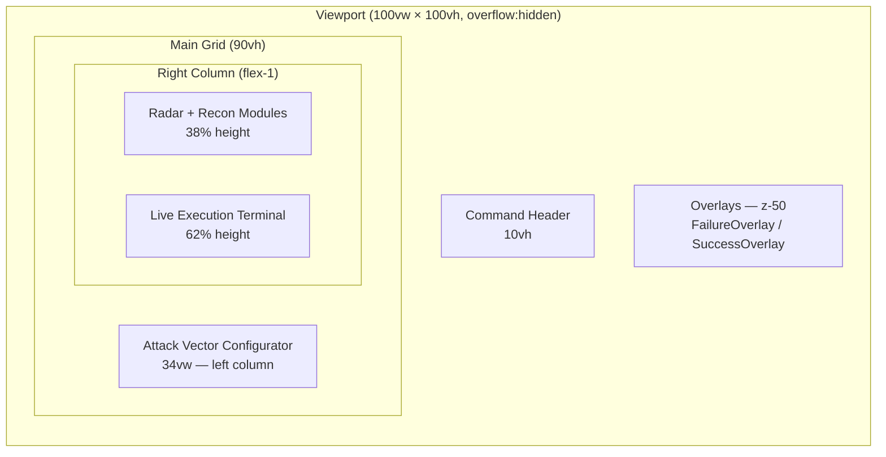
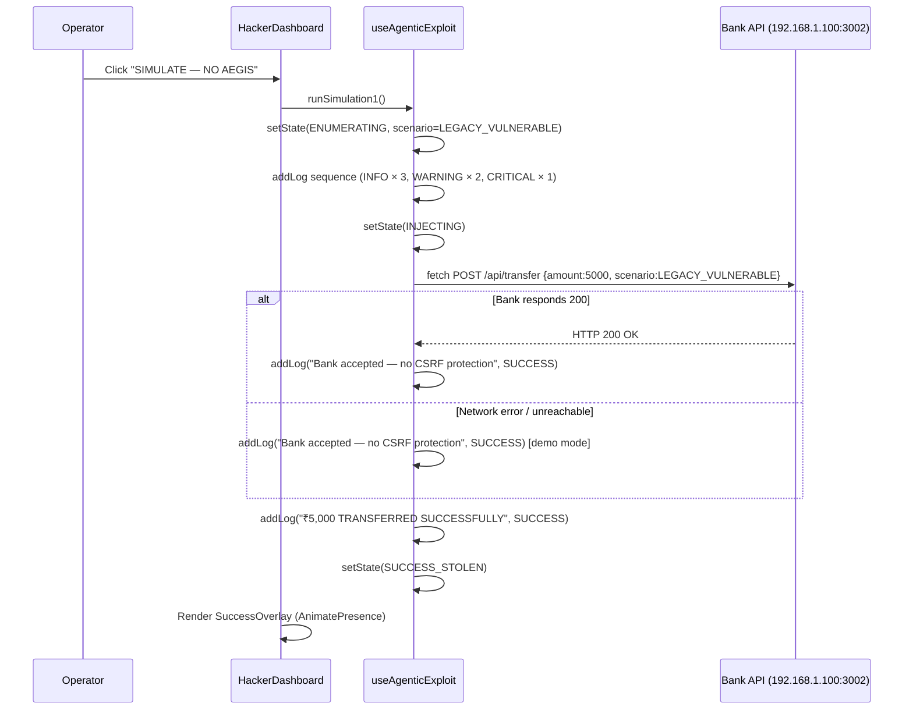
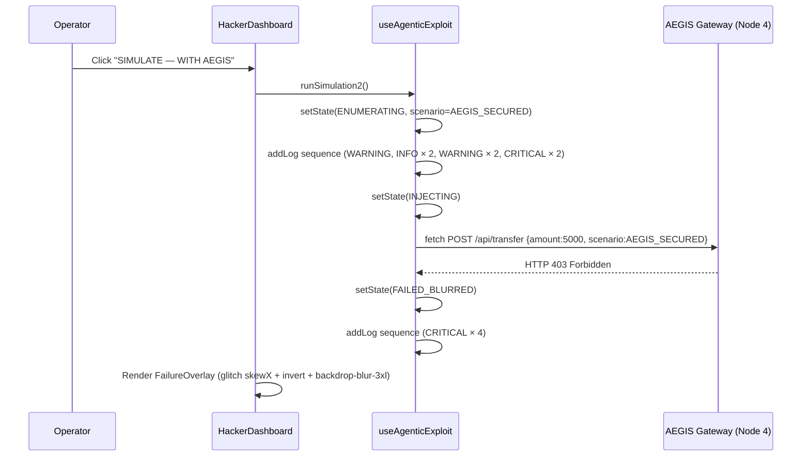
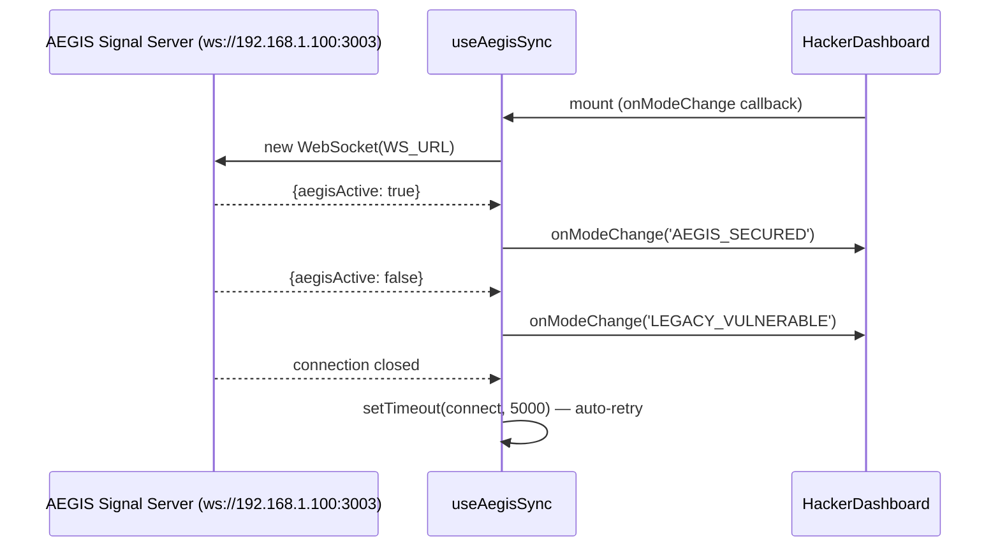

# Design Document: Hacker C2 Dashboard

## Overview

The Hacker C2 Dashboard is a production-ready Next.js 15 SPA representing "Node 3: The Threat Actor Command & Control (C2) Exploitation Framework" in a live 4-machine network security demonstration. It simulates Cross-Site Request Forgery (CSRF) attacks against the AEGIS API Gateway (Node 4), targeting a victim bank account (Person 1), with two distinct outcomes: silent fund theft when AEGIS is offline, and a catastrophic visual failure when AEGIS intercepts the attack.

The application lives entirely within the `hacker-ui/` subdirectory as a self-contained Next.js 15 project. All existing files (`types/exploit.ts`, `hooks/useAgenticExploit.ts`, `components/TerminalLog.tsx`, `components/RadarModule.tsx`, `components/FailureOverlay.tsx`, `components/SuccessOverlay.tsx`, `app/page.tsx`) are the implementation targets — the design below specifies the complete, production-ready versions of each.

---

## Architecture



### Layout Architecture



---

## Sequence Diagrams

### Case 1: Legacy Vulnerable (AEGIS Offline)



### Case 2: AEGIS Secured (Attack Blocked)



### WebSocket AEGIS Sync



---

## Components and Interfaces

### Component 1: `types/exploit.ts` — FSM Type Definitions

**Purpose**: Single source of truth for all TypeScript types used across the attack simulation FSM.

**Interface**:
```typescript
export type ExploitStatus =
  | 'IDLE'
  | 'ENUMERATING'
  | 'INJECTING'
  | 'SUCCESS_STOLEN'
  | 'FAILED_BLURRED';

export type ScenarioMode = 'LEGACY_VULNERABLE' | 'AEGIS_SECURED';

export interface LogEntry {
  id: string;           // `${Date.now()}-${Math.random()}`
  timestamp: string;    // HH:MM:SS from ISO string
  message: string;      // Terminal display text
  type: 'INFO' | 'WARNING' | 'CRITICAL' | 'SUCCESS';
}

export interface AttackState {
  status: ExploitStatus;
  scenario: ScenarioMode;
  targetUrl: string;              // http://192.168.1.100:3002/api/transfer
  logs: LogEntry[];
  ambientCredentialsEnabled: boolean;
}
```

**FSM Transition Diagram**:
```
IDLE ──runSimulation1/2──► ENUMERATING ──► INJECTING ──► SUCCESS_STOLEN
                                                     └──► FAILED_BLURRED
SUCCESS_STOLEN ──reset──► IDLE
FAILED_BLURRED ──reset──► IDLE
```

---

### Component 2: `hooks/useAgenticExploit.ts` — Core Attack Hook

**Purpose**: Drives the entire attack FSM. Manages state transitions, log accumulation, fetch calls, and scenario branching. Exposes `runSimulation1`, `runSimulation2`, and `reset`.

**Interface**:
```typescript
interface UseAgenticExploitReturn {
  state: AttackState;
  runSimulation1: () => Promise<void>;  // LEGACY_VULNERABLE path
  runSimulation2: () => Promise<void>;  // AEGIS_SECURED path
  reset: () => void;
}

export const useAgenticExploit: () => UseAgenticExploitReturn
```

**Responsibilities**:
- Maintain `AttackState` via `useState`
- Use `useRef` to avoid stale closure issues in async callbacks
- Sequence log entries with `setTimeout` delays for dramatic pacing
- Branch on `scenario` to determine fetch behavior and terminal outcome
- In `LEGACY_VULNERABLE`: treat any fetch result (including network error) as success for demo purposes
- In `AEGIS_SECURED`: treat any non-200 or thrown error as `FAILED_BLURRED`

---

### Component 3: `hooks/useAegisSync.ts` — WebSocket Mode Sync

**Purpose**: Silently subscribes to the AEGIS signal server WebSocket and calls `onModeChange` when the live AEGIS state changes. Falls back gracefully if the server is unreachable.

**Interface**:
```typescript
export const useAegisSync: (
  onModeChange: (mode: ScenarioMode) => void
) => void
```

**Responsibilities**:
- Connect to `ws://192.168.1.100:3003` on mount
- Parse `{ aegisActive: boolean }` messages
- Auto-retry on close with 5-second backoff
- Silently swallow all errors (manual toggle remains functional)

---

### Component 4: `components/TerminalLog.tsx` — Live Execution Terminal

**Purpose**: Renders `LogEntry[]` as a phosphor-green typewriter terminal with CRT chrome, auto-scroll, and per-type color coding.

**Interface**:
```typescript
interface TerminalLogProps {
  logs: LogEntry[];
}

export function TerminalLog({ logs }: TerminalLogProps): JSX.Element
```

**Sub-component**:
```typescript
function TypewriterLine({ entry }: { entry: LogEntry }): JSX.Element
// Reveals entry.message character-by-character via setInterval
// Speed: 12ms/char for CRITICAL, 16ms/char for others
// Shows blinking █ cursor while typing
```

**Responsibilities**:
- Render macOS-style terminal chrome (red/yellow/green dots, hostname)
- Auto-scroll to bottom ref on every new log entry
- Apply `AnimatePresence` for entry fade-in animations
- Show idle cursor when `logs` is empty

---

### Component 5: `components/RadarModule.tsx` — Recon & Evasion Modules

**Purpose**: Ambient visual module showing a fake AMTD port scanner and hardware attestation failure panel. Runs independently of attack state.

**Interface**:
```typescript
export function RadarModule(): JSX.Element
```

**Responsibilities**:
- Cycle random port numbers every 110ms (simulates brute-force scanning)
- Cycle random IPs from a fixed pool every 1800ms
- Blink WebGPU attestation warning at 850ms interval
- Display static ZK-PROOF / WEBRTC SHARD failure rows

---

### Component 6: `components/FailureOverlay.tsx` — Catastrophic Failure Overlay

**Purpose**: Full-screen Framer Motion overlay triggered on `FAILED_BLURRED`. Applies `backdrop-blur-3xl`, a glitch skewX+invert animation, and a centered red modal.

**Interface**:
```typescript
interface FailureOverlayProps {
  visible: boolean;
  onReset: () => void;
}

export function FailureOverlay({ visible, onReset }: FailureOverlayProps): JSX.Element
```

**Responsibilities**:
- Use `AnimatePresence` for mount/unmount transitions
- Animate glitch sequence: `skewX [-5, 5, -3, 3, -1, 1, 0]` + `filter: invert(1)` for 1.5s
- Apply `backdrop-blur-3xl` backdrop layer
- Render red modal with `ShieldOff` icon, failure message, error log lines
- Expose reset button that calls `onReset`

---

### Component 7: `components/SuccessOverlay.tsx` — Exploit Success Overlay

**Purpose**: Full-screen overlay triggered on `SUCCESS_STOLEN`. Applies a green phosphor glow and centered success modal.

**Interface**:
```typescript
interface SuccessOverlayProps {
  visible: boolean;
  onReset: () => void;
}

export function SuccessOverlay({ visible, onReset }: SuccessOverlayProps): JSX.Element
```

**Responsibilities**:
- Use `AnimatePresence` for mount/unmount
- Apply `backdrop-blur-2xl` with dark green tint
- Render green modal with `Zap` icon, `FUNDS ACQUIRED` headline, `₹5,000 REDIRECTED` subtext
- Show staggered success log lines (HTTP 200, SESSION COOKIES HIJACKED, etc.)
- Expose reset button

---

### Component 8: `app/page.tsx` — Main Dashboard Orchestrator

**Purpose**: Root page component. Composes all panels, manages layout, wires `useAgenticExploit` state to all child components.

**Interface**:
```typescript
export default function HackerDashboard(): JSX.Element
```

**Responsibilities**:
- Render full-viewport layout: Command Header (10vh) + Main Grid (90vh)
- Left column (34vw): Attack Vector Configurator with payload matrix, session hijack badge, sim buttons
- Right column: RadarModule (38%) + TerminalLog (62%)
- Fixed overlays: FailureOverlay + SuccessOverlay (z-50)
- CRT scanline overlay (fixed, z-10, pointer-events-none)
- Corner bracket decorations (fixed, z-20)

---

## Data Models

### AttackState (FSM Root)

```typescript
interface AttackState {
  status: ExploitStatus;              // Current FSM node
  scenario: ScenarioMode;             // Active simulation branch
  targetUrl: string;                  // Configurable target endpoint
  logs: LogEntry[];                   // Append-only log array
  ambientCredentialsEnabled: boolean; // Always true — credentials:include
}
```

**Validation Rules**:
- `status` must be one of the 5 `ExploitStatus` literals
- `logs` is append-only; never mutated in place
- `targetUrl` must be a valid HTTP URL string
- Transitions: only `IDLE → ENUMERATING`, `ENUMERATING → INJECTING`, `INJECTING → SUCCESS_STOLEN | FAILED_BLURRED`, `* → IDLE` (via reset)

### LogEntry

```typescript
interface LogEntry {
  id: string;        // Unique: `${Date.now()}-${Math.random()}`
  timestamp: string; // "HH:MM:SS" — ISO split on 'T' and '.'
  message: string;   // Human-readable terminal line
  type: LogType;     // 'INFO' | 'WARNING' | 'CRITICAL' | 'SUCCESS'
}
```

**Color Mapping**:
| type | CSS class | Hex |
|------|-----------|-----|
| INFO | `text-green-400` | `#4ade80` |
| WARNING | `text-yellow-400` | `#facc15` |
| CRITICAL | `text-red-400` | `#f87171` |
| SUCCESS | `text-green-300` | `#86efac` |

---

## Algorithmic Pseudocode

### Main Attack Execution Algorithm

```typescript
async function runSimulation(scenario: ScenarioMode): Promise<void> {
  // Precondition: state.status === 'IDLE'
  if (stateRef.current.status !== 'IDLE') return;

  // Phase 1: ENUMERATING
  setState({ status: 'ENUMERATING', scenario });
  await sequenceLog([
    { msg: `[SIM] AEGIS: ${scenario === 'LEGACY_VULNERABLE' ? 'OFFLINE' : 'ONLINE'}`, type: 'INFO', delay: 500 },
    { msg: 'Scanning target endpoint...', type: 'INFO', delay: 700 },
    { msg: `Target resolved: ${targetUrl}`, type: 'INFO', delay: 600 },
    ...(scenario === 'AEGIS_SECURED'
      ? [{ msg: 'Attempting AMTD port brute-force...', type: 'WARNING', delay: 800 }]
      : []),
  ]);

  // Phase 2: INJECTING
  setState({ status: 'INJECTING' });
  await sequenceLog([
    { msg: 'Forging POST request to bank transfer API...', type: 'WARNING', delay: 700 },
    { msg: 'Injecting session context from victim browser...', type: 'WARNING', delay: 700 },
    { msg: 'Sending payload: amount=₹5,000 → attacker_account...', type: 'CRITICAL', delay: 900 },
    ...(scenario === 'AEGIS_SECURED'
      ? [{ msg: 'Attempting WebRTC behavioral proof bypass...', type: 'CRITICAL', delay: 800 }]
      : []),
  ]);

  // Phase 3: Network call + outcome branch
  try {
    const response = await fetch(targetUrl, {
      method: 'POST',
      headers: { 'Content-Type': 'application/json' },
      body: JSON.stringify({ amount: 5000, receiver: 'attacker_offshore_acct', scenario }),
    });

    if (scenario === 'AEGIS_SECURED' && !response.ok) {
      throw new Error(`HTTP ${response.status}`);
    }

    // LEGACY_VULNERABLE: any result → success
    addLog('Bank server accepted request — no CSRF protection detected.', 'SUCCESS');
    addLog('₹5,000 TRANSFERRED SUCCESSFULLY. BANK UNAWARE.', 'SUCCESS');
    setState({ status: 'SUCCESS_STOLEN' });

  } catch {
    if (scenario === 'AEGIS_SECURED') {
      setState({ status: 'FAILED_BLURRED' });
      await sequenceLog([
        { msg: 'AEGIS Gateway: HTTP 403 Forbidden.', type: 'CRITICAL', delay: 500 },
        { msg: 'ERROR: WebRTC cryptographic shard missing.', type: 'CRITICAL', delay: 500 },
        { msg: 'ERROR: Zero-Knowledge Behavioral Proof rejected.', type: 'CRITICAL', delay: 500 },
        { msg: 'FATAL: EXPLOIT FAILED. CONNECTION SEVERED BY AEGIS.', type: 'CRITICAL', delay: 0 },
      ]);
    } else {
      // LEGACY: network error still shows success (demo mode)
      addLog('Bank server accepted request — no CSRF protection detected.', 'SUCCESS');
      setState({ status: 'SUCCESS_STOLEN' });
    }
  }
}
```

**Preconditions**:
- `state.status === 'IDLE'` before invocation
- `targetUrl` is a non-empty string
- `scenario` is a valid `ScenarioMode` literal

**Postconditions**:
- `state.status` is either `SUCCESS_STOLEN` or `FAILED_BLURRED` after completion
- `state.logs` contains at minimum 6 entries
- `state.scenario` matches the `scenario` argument

**Loop Invariants**: N/A (sequential async steps, no loops)

---

### TypewriterLine Reveal Algorithm

```typescript
function TypewriterLine({ entry }: { entry: LogEntry }) {
  // Precondition: entry.message is a non-empty string
  const [displayed, setDisplayed] = useState('');

  useEffect(() => {
    let i = 0;
    const speed = entry.type === 'CRITICAL' ? 12 : 16; // ms per character
    const interval = setInterval(() => {
      i++;
      setDisplayed(entry.message.slice(0, i));
      // Loop invariant: displayed.length === i - 1 at start of each tick
      if (i >= entry.message.length) clearInterval(interval);
    }, speed);
    return () => clearInterval(interval); // cleanup on unmount
  }, [entry.message, entry.type]);

  // Postcondition: displayed === entry.message when interval completes
}
```

**Preconditions**: `entry.message.length > 0`
**Postconditions**: `displayed === entry.message` after `message.length * speed` ms
**Loop Invariants**: `i` increments monotonically; `displayed.length < entry.message.length` while interval is active

---

### Glitch Animation Sequence (FailureOverlay)

```typescript
// Framer Motion animate sequence for catastrophic failure
const glitchSequence = {
  skewX: [0, -5, 5, -3, 3, -1, 1, 0],
  filter: ['invert(0)', 'invert(1)', 'invert(0)', 'invert(1)', 'invert(0)', 'invert(0)'],
  opacity: [1, 0.8, 1, 0.9, 1],
};
// Duration: 1.5s total, ease: 'easeInOut'
// Runs once on mount (no repeat)
// Postcondition: element returns to skewX(0), filter:invert(0) after sequence
```

---

## Key Functions with Formal Specifications

### `addLog(message, type)`

```typescript
const addLog = useCallback((message: string, type: LogEntry['type']) => {
  setState(prev => ({
    ...prev,
    logs: [...prev.logs, {
      id: `${Date.now()}-${Math.random()}`,
      timestamp: new Date().toISOString().split('T')[1].split('.')[0],
      message,
      type,
    }],
  }));
}, []);
```

**Preconditions**: `message` is non-empty string; `type` is valid `LogEntry['type']`
**Postconditions**: `state.logs.length` increases by exactly 1; new entry is appended at tail
**No side effects** on existing log entries

---

### `reset()`

```typescript
const reset = useCallback(() => {
  setState(prev => ({ ...prev, status: 'IDLE', logs: [], scenario: 'AEGIS_SECURED' }));
}, []);
```

**Preconditions**: None (callable from any state)
**Postconditions**: `state.status === 'IDLE'`, `state.logs.length === 0`, `state.scenario === 'AEGIS_SECURED'`

---

### `TerminalLog` auto-scroll

```typescript
useEffect(() => {
  bottomRef.current?.scrollIntoView({ behavior: 'smooth' });
}, [logs]);
// Precondition: bottomRef is attached to a DOM element
// Postcondition: viewport scrolled to show most recent log entry
```

---

## Example Usage

```typescript
// app/page.tsx — wiring the hook to the UI
export default function HackerDashboard() {
  const { state, runSimulation1, runSimulation2, reset } = useAgenticExploit();

  const isRunning = state.status === 'ENUMERATING' || state.status === 'INJECTING';
  const isDone = state.status === 'SUCCESS_STOLEN' || state.status === 'FAILED_BLURRED';

  return (
    <div className="relative min-h-screen bg-black font-mono overflow-hidden crt-flicker scanline-sweep hex-bg">
      {/* ... layout ... */}
      <TerminalLog logs={state.logs} />
      <RadarModule />
      <FailureOverlay visible={state.status === 'FAILED_BLURRED'} onReset={reset} />
      <SuccessOverlay visible={state.status === 'SUCCESS_STOLEN'} onReset={reset} />
    </div>
  );
}

// Triggering simulations
<button onClick={runSimulation1} disabled={isRunning || isDone}>
  SIMULATE — NO AEGIS
</button>
<button onClick={runSimulation2} disabled={isRunning || isDone}>
  SIMULATE — WITH AEGIS
</button>
```

---

## Correctness Properties

1. **FSM Exclusivity**: At any point in time, `state.status` is exactly one of the 5 `ExploitStatus` literals — never undefined, never a combination.

2. **Log Append-Only**: `state.logs` is strictly append-only. No existing `LogEntry` is ever mutated or removed during an attack run. Only `reset()` clears the array.

3. **Scenario Consistency**: When `runSimulation1` completes, `state.scenario === 'LEGACY_VULNERABLE'`. When `runSimulation2` completes, `state.scenario === 'AEGIS_SECURED'`. These never cross.

4. **Terminal Idempotency**: Calling `reset()` from any terminal state (`SUCCESS_STOLEN` or `FAILED_BLURRED`) always produces `{ status: 'IDLE', logs: [], scenario: 'AEGIS_SECURED' }`.

5. **Guard Clause**: `runSimulation1` and `runSimulation2` are no-ops if `state.status !== 'IDLE'`. Concurrent invocations cannot corrupt state.

6. **Overlay Mutual Exclusion**: `FailureOverlay` and `SuccessOverlay` are never both `visible: true` simultaneously, because `state.status` can only be one value.

7. **Typewriter Completion**: For every `LogEntry` rendered by `TypewriterLine`, `displayed` eventually equals `entry.message` (the interval always runs to completion unless the component unmounts).

8. **WebSocket Resilience**: `useAegisSync` never throws to the caller. All WebSocket errors are caught internally. The manual scenario toggle always remains functional regardless of WebSocket state.

---

## Error Handling

### Error Scenario 1: Bank API Unreachable (LEGACY_VULNERABLE)

**Condition**: `fetch()` throws a network error (server offline, CORS, timeout)
**Response**: Catch block treats the error as a success — `addLog("Bank server accepted request", 'SUCCESS')` — and transitions to `SUCCESS_STOLEN`
**Recovery**: Demo continues normally; audience sees the "success" outcome as intended

### Error Scenario 2: AEGIS Returns Non-403 Error (AEGIS_SECURED)

**Condition**: `fetch()` throws or returns any non-200 status
**Response**: Any error/non-OK response triggers `FAILED_BLURRED` transition
**Recovery**: `FailureOverlay` renders; operator clicks RESET to return to `IDLE`

### Error Scenario 3: WebSocket Connection Failure

**Condition**: `ws://192.168.1.100:3003` is unreachable or closes unexpectedly
**Response**: `useAegisSync` silently catches the error; schedules reconnect in 5 seconds
**Recovery**: Manual scenario toggle on the dashboard remains fully functional

### Error Scenario 4: Concurrent Attack Invocation

**Condition**: User clicks a simulation button while `status !== 'IDLE'`
**Response**: Guard clause `if (stateRef.current.status !== 'IDLE') return` exits immediately
**Recovery**: No state corruption; buttons are visually disabled during active runs

---

## Testing Strategy

### Unit Testing Approach

Test the `useAgenticExploit` hook in isolation using `@testing-library/react` `renderHook`:
- Verify initial state shape matches `AttackState` defaults
- Verify `reset()` always returns to canonical idle state
- Verify guard clause prevents concurrent invocations
- Verify `addLog` appends exactly one entry per call

### Property-Based Testing Approach

**Property Test Library**: fast-check

Key properties to test:
- For any sequence of `addLog` calls, `state.logs.length` equals the number of calls made
- For any terminal state, calling `reset()` produces identical idle state regardless of prior history
- `runSimulation1` always terminates in `SUCCESS_STOLEN` (never `FAILED_BLURRED`)
- `runSimulation2` always terminates in `FAILED_BLURRED` (never `SUCCESS_STOLEN`)

### Integration Testing Approach

Manual demo walkthrough checklist:
1. Load dashboard → verify `IDLE` state, empty terminal, blinking cursor
2. Click "SIMULATE — NO AEGIS" → verify log sequence, `SuccessOverlay` appears with correct amount
3. Click RESET → verify return to `IDLE`
4. Click "SIMULATE — WITH AEGIS" → verify log sequence, glitch animation fires, `FailureOverlay` appears
5. Click RESET → verify return to `IDLE`
6. Verify both buttons are disabled during active simulation

---

## Performance Considerations

- `useCallback` on `addLog` and `reset` prevents unnecessary re-renders of child components
- `useRef` for `stateRef` avoids stale closure issues in async callbacks without triggering re-renders
- `AnimatePresence` ensures overlay components are fully unmounted (not just hidden) when not visible, reducing DOM complexity
- `RadarModule` uses `setInterval` with cleanup — no memory leaks on unmount
- Terminal auto-scroll uses `scrollIntoView` (native, no layout thrash) triggered only on `logs` array change

---

## Security Considerations

This is a demonstration application. The following are intentional design choices for the demo context:

- `credentials: 'include'` in `fetch()` is the attack vector being demonstrated — it is intentional
- No real credentials or PII are transmitted; all payload values are mock data
- The `LEGACY_VULNERABLE` scenario treats network errors as success to ensure the demo works even when the bank server is offline
- The application should only be run on an isolated demo network (192.168.x.x range), never on a production network

---

## Dependencies

| Package | Version | Purpose |
|---------|---------|---------|
| `next` | ^15.0.0 | App Router, SSR/SPA framework |
| `react` / `react-dom` | ^19.0.0 | UI rendering |
| `framer-motion` | ^11.0.0 | All animations: overlays, glitch, typewriter cursors |
| `lucide-react` | ^0.400.0 | Icons: Skull, Crosshair, Terminal, Radar, Cpu, Zap, Radio, ShieldOff |
| `tailwindcss` | ^4.0.0 | Utility-first styling with arbitrary values |
| `@tailwindcss/postcss` | ^4.0.0 | Tailwind v4 PostCSS integration |
| `@radix-ui/react-toggle` | ^1.1.0 | Accessible scenario mode toggle primitive |
| `typescript` | ^5.0.0 | Strict type checking |
| `next/font/google` | (bundled) | JetBrains Mono font loading |
